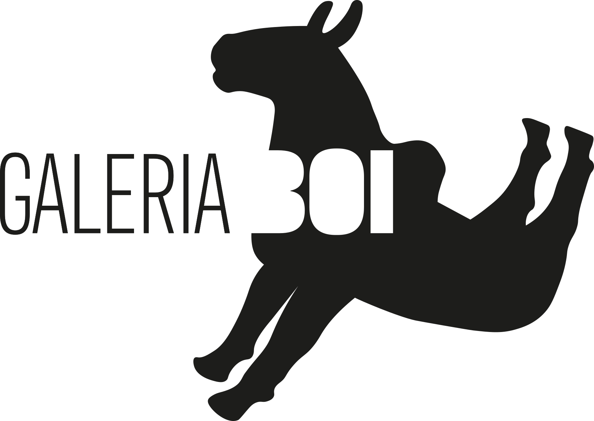
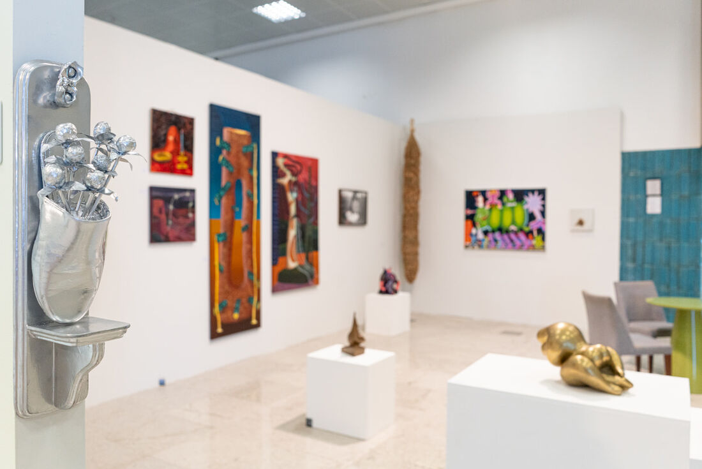
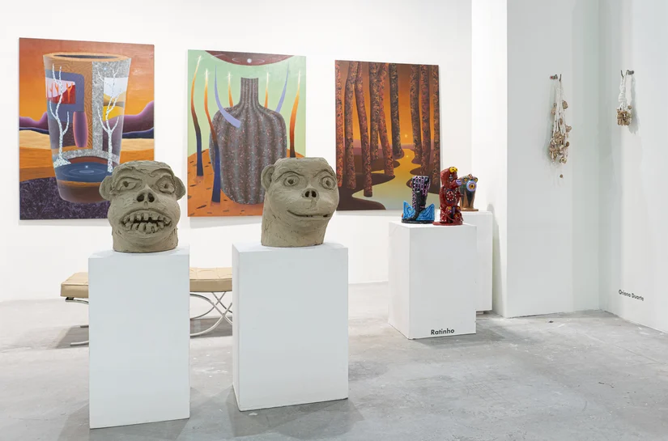
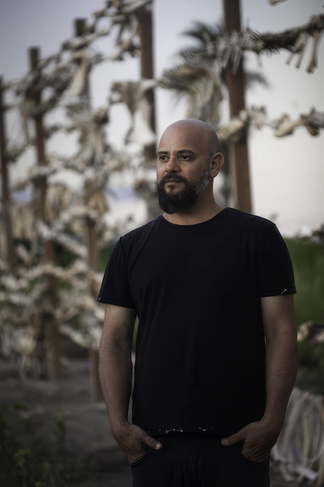

<html lang="pt-BR" class="scroll-smooth">
<head>
    <meta charset="UTF-8">
    <meta name="viewport" content="width=device-width, initial-scale=1.0">
    <title>Galeria Boi | Apresentação</title>
    
    <!-- Google Fonts -->
    <link rel="preconnect" href="https://fonts.googleapis.com">
    <link rel="preconnect" href="https://fonts.gstatic.com" crossorigin>
    <link href="https://fonts.googleapis.com/css2?family=Inter:wght@300;400;500&family=Playfair+Display:ital,wght@0,400;0,600;1,400&display=swap" rel="stylesheet">
    
    <!-- Tailwind CSS -->
    
    
    

    
</head>
<body class="antialiased selection:bg-gallery-black selection:text-white">

    <!-- Navegação -->
    <nav id="navbar" class="fixed top-0 w-full z-[99] transition-all duration-300 pointer-events-none">
        

            
            <!-- Logo blindada -->
            
            
            <!-- Desktop Links -->
            

                <a href="#apresentacao" class="hover:opacity-60 transition-opacity">A Galeria</a>
                <a href="#diretor" class="hover:opacity-60 transition-opacity">O Diretor</a>
                <a href="#contato" class="hover:opacity-60 transition-opacity">Contato</a>
            

            
            <!-- Mobile Menu Button -->
            

                <button onclick="toggleMobileMenu()" class="uppercase text-xs tracking-widest hover:opacity-70 transition-opacity">Menu</button>
            

        

    </nav>

    <!-- Menu Mobile Overlay -->
    

        <button onclick="toggleMobileMenu()" class="absolute top-6 right-6 p-4 uppercase text-xs tracking-widest opacity-70 hover:opacity-100">Fechar</button>
        

            <a href="#apresentacao" onclick="toggleMobileMenu()" class="hover:text-gallery-gray transition-colors">A Galeria</a>
            <a href="#diretor" onclick="toggleMobileMenu()" class="hover:text-gallery-gray transition-colors">O Diretor</a>
            <a href="#contato" onclick="toggleMobileMenu()" class="hover:text-gallery-gray transition-colors">Contato</a>
        

    

    <!-- Hero Section -->
    <section id="hero" class="w-full min-h-screen flex flex-col lg:flex-row relative bg-gallery-white">
        <!-- Lado do Texto -->
        

            

                
Sobre Nós

                <h1 class="text-6xl md:text-7xl lg:text-[5.5rem] font-serif leading-none mb-10">NOVA FORNOS</h1>
                

                    Um espaço de pesquisa, documentação, fomento e exibição da produção artística contemporânea. Deslize para baixo para conhecer a nossa história e missão.
                

                <a href="#apresentacao" class="inline-flex items-center gap-4 text-sm uppercase tracking-widest font-medium group pb-2 border-b border-gallery-black/20 hover:border-gallery-black transition-colors">
                    Conhecer a Galeria
                    ↓
                </a>
            

        

        <!-- Lado da Imagem com o ficheiro galeria.jpg -->
        

            
        

    </section>

    <!-- Seção de Apresentação da Galeria -->
    <section id="apresentacao" class="py-24 md:py-32 bg-gallery-white w-full">
        

            
            

                

                    <!-- Removido o filtro grayscale desta imagem -->
                    
                

            

            

                <h2 class="text-4xl md:text-5xl font-serif mb-8 text-gallery-black">O Espaço</h2>
                

                

                    

                        Fundada em 2021 em Caruaru, a Galeria Boi é um espaço de pesquisa, documentação, fomento e exibição da produção artística contemporânea. Propõe estratégias curatoriais colaborativas que fomentem o diálogo entre diferentes gerações e distintas perspectivas culturais. 
                    

                    

                        Mantém como diretriz principal o estímulo às práticas artísticas caracterizadas pelo conceitualismo, pela ênfase nos processos e pela postura crítica, muitas vezes subversiva.
                    

                    

                        A Galeria desenvolve um programa especial de investigação em torno da produção de jovens bem como de renomados artistas, flexionando o anagrama <strong>AGRESTE_RESGATE</strong>, referência à região onde acontece a Bienal do Barro e funciona a sede da Galeria, o Agreste Pernambucano. 
                    

                    

                        Diferencia-se promovendo uma atualização histórica de processos desenvolvidos a partir de forte resistência intelectual e geopolítica, cujo desafio e compromisso é o contra-hegemônico, promovendo a transformação dos agentes do mercado de arte no país, cuja atuação foi exclusivamente no Sudeste ao longo das últimas décadas.
                    

                

            

        

    </section>

    <!-- Seção do Diretor -->
    <section id="diretor" class="py-24 md:py-32 bg-gallery-offwhite w-full">
        

            
            

                
Diretor & Idealizador

                <h2 class="text-4xl md:text-5xl font-serif mb-8 text-gallery-black">Carlos Mélo</h2>
                

                

                    

                        A Galeria Boi é uma extensão visceral da <strong>Primeira Bienal do Barro do Brasil</strong>, concebida e idealizada pelo artista e diretor da galeria, Carlos Mélo.
                    

                    

                        Com uma visão focada na descentralização da arte contemporânea, Carlos busca resgatar a potência do Agreste Pernambucano, transformando-o num polo ativo de reflexão, criação e exibição artística que desafia as narrativas tradicionais do eixo hegemônico.
                    

                

            

            

                <!-- Mantido o alinhamento perfeito à esquerda com o texto e o filtro grayscale aqui -->
                

                    
                

            

        

    </section>

    <!-- Rodapé PRETO com Contatos Atualizados -->
    <footer id="contato" class="bg-gallery-black text-white py-24 px-8 md:px-16 w-full">
        

            

                <!-- Logo no Rodapé blindada (logo-safe + logo-white) -->
                
                

                    Galeria Boi é uma extensão da Primeira Bienal do Barro do Brasil. Um espaço de pesquisa, fomento e exibição da produção artística contemporânea, operando na interseção do conceitualismo, processos críticos e resistência geopolítica.
                

            

            
            

                <h4 class="uppercase tracking-widest text-xs font-semibold mb-6 text-white w-full">Localização</h4>
                

                    Travessa Mestre Vitalino, 9α 
                    Alto do Moura, Caruaru - PE 
                    CEP: 55000-000 
                    Ter - Sáb, 11h às 19h
                

            

            
            

                <h4 class="uppercase tracking-widest text-xs font-semibold mb-6 text-white w-full">Contato</h4>
                <ul class="text-sm text-gray-400 font-light space-y-3 w-full p-0 m-0">
                    <li><a href="mailto:gaaleriaboi@gmail.com" class="hover:text-white transition-colors">gaaleriaboi@gmail.com</a></li>
                    <li><a href="tel:+5581997186677" class="hover:text-white transition-colors">+55 81 9 9718 6677</a></li>
                    <li><a href="https://www.instagram.com/galeriaboi/" target="_blank" rel="noopener noreferrer" class="hover:text-white transition-colors">@galeriaboi</a></li>
                </ul>
            

        

        

            
&copy; 2026 Galeria Boi. Todos os direitos reservados.

            
Design web otimizado

        

    </footer>

    <!-- JAVASCRIPT SIMPLIFICADO E LIMPO -->
    
</body>
</html>
